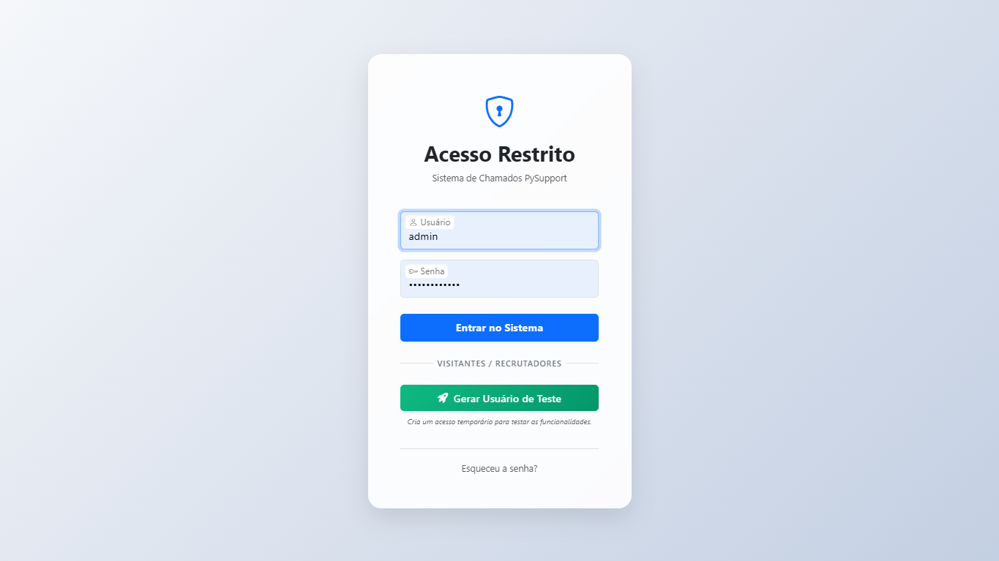
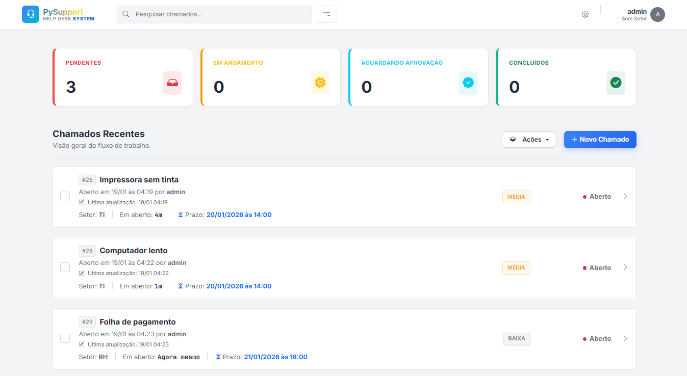
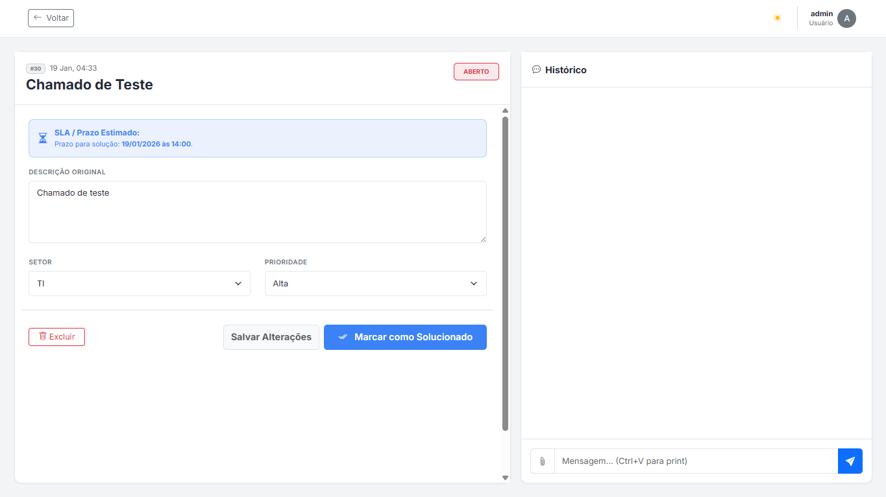
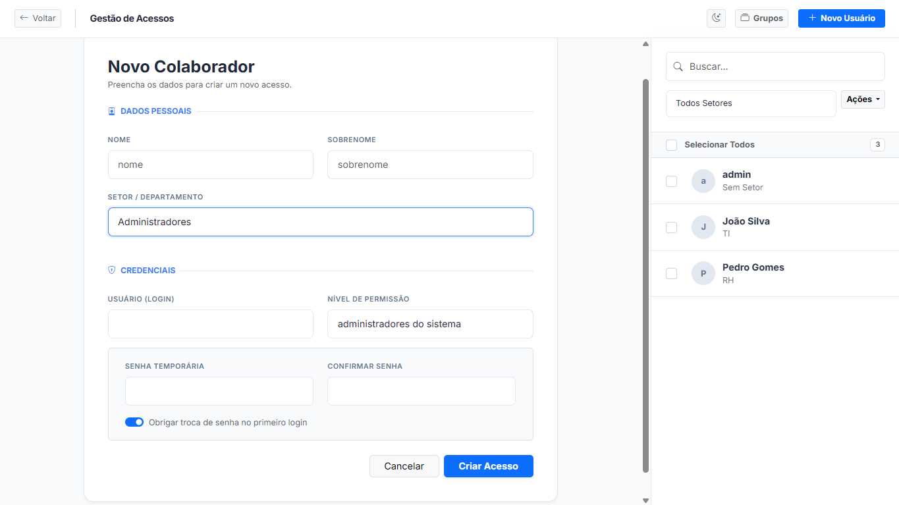
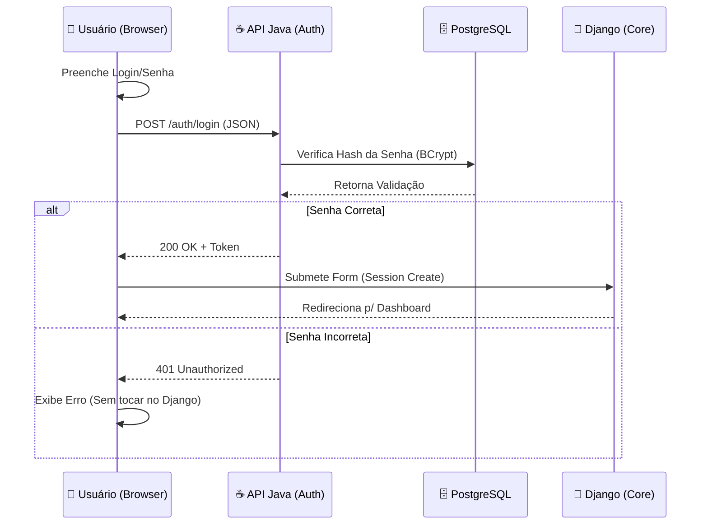

<div align="center">

# 🛡️ PySupport | Secure Help Desk System

### Um Service Desk corporativo com arquitetura híbrida, foco em SLA realista e segurança

<br>

<p align="center">
  
  &nbsp;&nbsp;&nbsp;&nbsp;
  
  &nbsp;&nbsp;&nbsp;&nbsp;
  
  &nbsp;&nbsp;&nbsp;&nbsp;
  
  &nbsp;&nbsp;&nbsp;&nbsp;
  
  &nbsp;&nbsp;&nbsp;&nbsp;
  
</p>

<p align="center">
  
  &nbsp;&nbsp;&nbsp;&nbsp;
  
  &nbsp;&nbsp;&nbsp;&nbsp;
  
</p>

[Sobre o Projeto](#-sobre-o-projeto) • [Funcionalidades](#-funcionalidades-principais) • [SLA](#-sla-e-horas-uteis) • [Galeria](#-galeria) • [Instalação](#-instalação-e-execução)

</div>

<br>

---

## 💡 Visão Geral

O **PySupport** é um sistema de **Help Desk / Service Desk corporativo**, desenvolvido com foco em **boas práticas reais de mercado**: separação de responsabilidades, segurança, regras de negócio claras e métricas confiáveis.

O objetivo do projeto não é apenas “abrir chamados”, mas **simular um ambiente profissional**, onde:

* SLAs seguem horários comerciais reais
* A autenticação é tratada como um ponto crítico de segurança
* Usuários possuem permissões bem definidas
* Métricas ajudam na tomada de decisão

Trata-se de um projeto **full stack**, funcional e pronto para produção, ideal para demonstrar domínio técnico em processos de TI.

---

## ✨ Funcionalidades Principais

* 🔐 **Login seguro em duas camadas**  
  O acesso ao sistema é validado por um serviço separado, aumentando a segurança dos dados.

* ⏱️ **Controle inteligente de prazos (SLA)**  
  O sistema calcula automaticamente o tempo de atendimento considerando horário comercial, finais de semana e feriados.

* 👥 **Gestão completa de usuários e setores**  
  - Criar, editar, remover usuários e setores
  - Definir grupos e níveis de acesso
  - Exportar relatórios de usuários e chamados em **Excel (.xlsx)**

* 📊 **Dashboard com indicadores em tempo real**  
  Visão geral dos chamados com números claros e gráficos para facilitar decisões rápidas.

* 🖼️ **Envio de arquivos facilitado**  
  É possível anexar arquivos, arrastar documentos ou até colar prints diretamente no chamado (**Ctrl+V**).

* 🏢 **Acesso por setor e função**  
  Cada usuário vê apenas os chamados relacionados ao seu setor, garantindo organização e privacidade.

* 🧾 **Histórico completo dos chamados**  
  Todas as interações ficam registradas com data e hora, garantindo rastreabilidade.

* 🌙 **Modo claro e escuro**  
  O sistema salva automaticamente a preferência de tema do usuário.

---

## ⚙️ SLA e Horas Úteis

O cálculo de SLA é um dos pontos centrais do projeto. O tempo **não é contado de forma linear**, evitando distorções comuns em sistemas simples.

### ⏳ Prioridades

| Prioridade | SLA      | Descrição                        |
| ---------- | -------- | -------------------------------- |
| 🔴 Alta    | 6 horas  | Incidente crítico / parada total |
| 🟡 Média   | 16 horas | Impacto parcial na operação      |
| 🟢 Baixa   | 30 horas | Dúvidas, acessos e solicitações  |

### 📅 Regras de Contagem

* Horário comercial: **08:00 às 18:00**
* Sábados e domingos são ignorados
* Feriados pausam a contagem

> **Exemplo:** um chamado com **Prioridade Alta** aberto às 17h de sexta-feira vence apenas às **13h da segunda-feira seguinte.**

---

## 📸 Previews

<div align="center">

| Login                                                | Dashboard                               |
| ---------------------------------------------------- | --------------------------------------- |
|  |  |

<br>

| Chamado                                           | Gestão de Usuários                          |
| ------------------------------------------------- | ------------------------------------------- |
|  |  |

</div>

---

## 🏗️ Arquitetura Híbrida

O fluxo de login é interceptado pelo Front-end, que consulta o microsserviço Java antes de permitir a criação da sessão no Django.



---

## 🛠️ Tecnologias Utilizadas

### Backend

* **Python 3.14 + Django 5.0**  
  Responsáveis pela lógica principal do sistema, regras de negócio, telas, controle de usuários e fluxo dos chamados.

* **Bibliotecas de data e tempo**  
  Utilizadas para calcular prazos de atendimento (SLA), considerando horário comercial, finais de semana e feriados.

* **Pandas / OpenPyXL**  
  Usadas para gerar relatórios e exportações de dados em formato **Excel (.xlsx)**.

* **Java 17 + Spring Boot 3**  
  Microsserviço responsável pela autenticação e validação segura de credenciais via API REST.

* **PostgreSQL**  
  Banco de dados relacional onde todas as informações do sistema são armazenadas de forma segura e estruturada.

---

### Frontend

* **HTML5 / CSS3 (Bootstrap 5.3)**  
  Estrutura e estilo das telas, com layout limpo e visual moderno.

* **JavaScript (ES6+)**  
  Comunicação assíncrona com o backend, atualização dinâmica da interface e melhor experiência do usuário.

* **Jinja2**  
  Motor de templates utilizado pelo Django para renderizar páginas dinâmicas.

---

### DevOps & Tools

* **Docker**  
  Containerização da aplicação, facilitando execução local e deploy em qualquer ambiente.

* **Render (PaaS)**  
  Plataforma de nuvem utilizada para publicar a aplicação em produção.

* **Neon Tech**  
  Banco de dados PostgreSQL serverless, garantindo escalabilidade e disponibilidade.

* **Git / GitHub**  
  Controle de versão, histórico do projeto e colaboração.

---

## 🚀 Instalação e Execução

Você pode rodar este projeto localmente usando Docker (recomendado) ou manualmente.

### Pré-requisitos

* Python 3.10+
* Java JDK 17+
* PostgreSQL

<details>
<summary><strong>🐳 Opção 1: Rodar Banco de Dados (Docker)</strong></summary>

Se você não quiser instalar o Postgres na máquina, rode:

```bash
docker run --name pysupport-db -e POSTGRES_PASSWORD=admin -e POSTGRES_DB=pysupport_db -p 5432:5432 -d postgres

```

</details>

<details>
<summary><strong>☕ Opção 2: Rodar Backend Java (Auth API)</strong></summary>

1. Entre na pasta:

```bash
cd backend-java

```

2. Configure o banco em `src/main/resources/application.properties` (ou use variáveis de ambiente).
3. Rode a aplicação:

```bash
./mvnw spring-boot:run

```

*A API ficará disponível em `http://localhost:8080*`

</details>

<details>
<summary><strong>🐍 Opção 3: Rodar Backend Python (Django Core)</strong></summary>

1. Entre na pasta:

```bash
cd backend-python

```

2. Crie o ambiente virtual e instale as dependências:

```bash
python -m venv venv
# Windows:
source venv/Scripts/activate
# Linux/Mac:
source venv/bin/activate

pip install -r requirements.txt

```

3. Rode as migrações e o servidor:

```bash
python manage.py migrate
python manage.py runserver

```

*O sistema ficará disponível em `http://127.0.0.1:8000*`

</details>

---

<div align="center">

### Developed by *Gustavo Percoski*

*IT Support Technician | Jr. Full Stack Developer*

<a href="https://www.linkedin.com/in/gustavo-percoski/" target="_blank">

</a>
&nbsp;
<a href="https://www.instagram.com/pski.gustavo/" target="_blank">

</a>
&nbsp;
<a href="mailto:gustavopercoski2@GMAIL.COM">

</a>
&nbsp;
<a href="https://wa.me/5551991651479" target="_blank">

</a>

</div>
